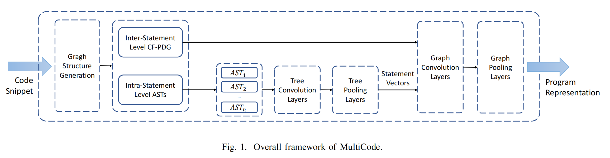
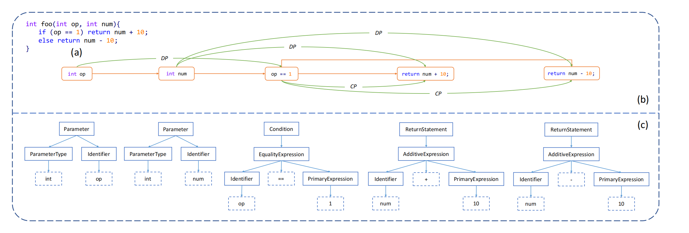
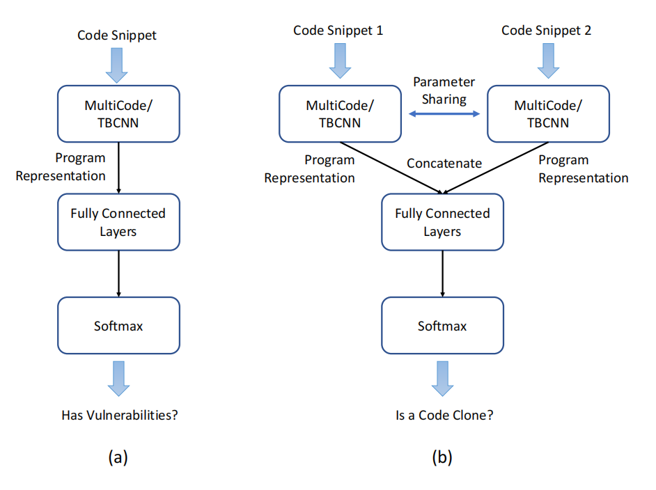
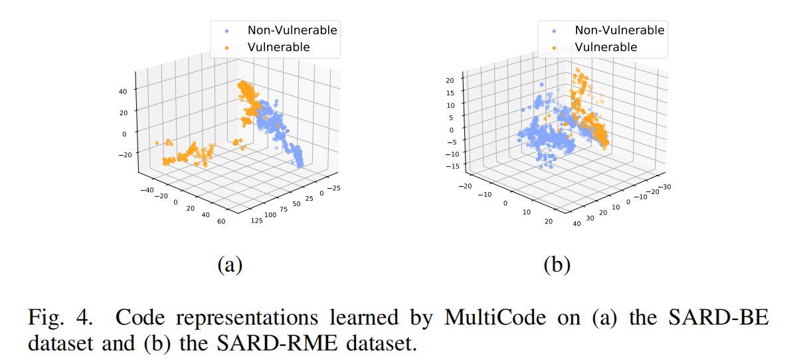
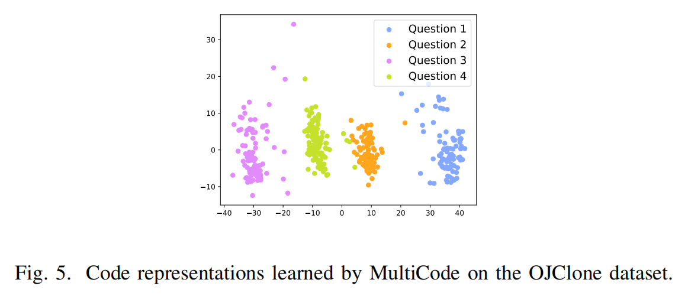

# MultiCode
A Unified Code Analysis Framework based on Multi-type and Multi-granularity Semantic Learning

<!--s-->

# MultiCode Introduction

<!--v-->

## Pre-Requisite Knowledge(From GPT)

1. 抽象语法树(AST)
   * 定义：表示源代码语法结构的树形结构
   * 用途：用于编译器设计中的语法分析、静态代码分析...
2. 控制流图(CFG)
   * 定义：展示了程序中所有可能的控制流路径
   * 用途：分析程序的运行流程
3. 程序依赖图(PDG)
   * 定义：表示程序中各元素间依赖关系的图
   * 用途：用于程序理解、测试、调试以及并行编译等领域。

<!--v-->

## MultiCode Introduction

MultiCode是一个新颖的代码分析框架，<u>通过学习不同类型和不同粒度的代码语义信息</u>（Unified），从而能够更高效地适应多种任务。

* 「不同粒度的代码分析」
   * 语句内层次（Intra-statement level）：关注单个语句内的结构和语义。
   * 语句间层次（Inter-statement level）：考虑多个语句之间的关系和交互。

<!--v-->

## Related Work

Learn code semantics and model code
1. TBCNN: Tree-based convolutions over the AST
2. Code2vec: A collection of paths in AST

Vulnerability Detection:
* VulDeePecke(word2vec)、Kim(AST + CFG)

Code Clone Detection
 * DeepSim(CFG + DFG)、CDLH(AST-based LSTM)、FCDetector(AST + CFG + word2vec + graph2vec)

Multicode🌟: fully model semantics(AST + CFG + PDG)

➡️ Be effectively adapted to multiple tasks with higher accuracy
<!--s-->

# Methodology

<!--v-->

##  Overall Framework

1. Generate ASTs and CF-PDG(CFG + PDG)
2. Compute the statement representations by tree-based convolutions and poolings over ASTs
3. Graph-based convolutions and poolings ➡️ Program representation
4. Effectively adapt to <u>different</u> code analysis tasks

<!--v-->

##  Code Graph Structures

* Model code semantics
* Multi-type and Multi-granularity
  * Multi-type: AST + CFG + PDG
  * Multi-granularity
    * Inter-Statement Level CF-PDG(coarse-grained)
    * Intra-Statement Level ASTs&nbsp;&nbsp;(fine-grained)
<!--v-->

## Example

(a) A snippet of example code

(b) The inter-statement level CF-PDG

(c) The intra-statement level ASTs

* Token-enhanced nodes
    * e.g., identifiers, operators, primary expression

<!--v-->

## Intra-Statement Level Tree Convolution

1. Initial Vector Representation
   * One-hot encoded characters $c_i$ 
   * Arbitrarily defined identifiers
     * e.g., `int abc = 1;`
   * PACE: position determines weight
   * $\vec{h}=vec(s)=\sum_{i=1}^{k}\frac{k - i + 1}{k} \times vec(c_i)$
<!--v-->

## Intra-Statement Level Tree Convolution

2.  Tree-based Convolution
    * Suppose  the parent representation is $\vec{h}_0$ and the children
representations are $\vec{h}_1,\vec{h}_2,\vec{h_3}...\vec{h}_n$
$$
\vec{h}_0'=\sigma(\sum\_{i=0}^{n}W_i\vec{h}_i+b)
$$
<h4>$\vec{h}_0'$ denotes new representation</h4>
<h4>$W_i$ denotes weight matrix of node i</h4>
<h4>$b$ denotes bias term </h4>
<h4>$\sigma$ denotes activation function</h4>

* The varying number of child nodes in AST!
* How many matrices need to be determined?

<!-- .element: class="fragment" -->

<!--v-->
## Intra-Statement Level Tree Convolution

*  Treat AST as a continuous binary tree. 
*  Define three basic weight matrices $W_t, W_l, W_r$
$$
W_i=\eta_i^tW^t+\eta_i^lW^l+\eta_i^rW^r
$$
$$
\eta_i^t=\frac{d_i-1}{d-1}
$$
$$
\eta_i^r=(1-\eta_i^t)\frac{w_i-1}{w-1}
$$
$$
\eta_i^l=(1-\eta_i^t)(1-\eta_i^r)
$$
<h4>$d_i$ and $w_i$ denote the vertical and horizontal position of the nodes in the window, respectively. $d$, $w$ denote the depth and width of the window,respectively</h4>

<!--v-->
## Intra-Statement Level Tree Convolution
* $d$ is set to 2
* $w$ is set to the maximum number of child nodes
* Zero vectors are padded

Positive outcome：
1. The number of weight matrices is fixed（$W_t, W_l, W_r$）
2. The position of nodes in the tree is fully considered（$d_i,w_i$）

<!-- .element: class="fragment" -->

<!--v-->
## Intra-Statement Level Tree Convolution

3. Tree Pooling
   * What we have now?
     * the updated representations and the unchanged shape of the tree.
   * Max Pooling
     * the maximum value in each dimension is extracted and concatenated as the final vector representation.

   * Code Snippet ➡️ AST ➡️ Vector Representation        
   * Be used as the initial vector representations

<!-- .element: class="fragment" -->

<!--v-->
## Inter-Statement Level Graph Convolution

What we have?
*  The fine-grained semantic information(ASTs)
*  The coarse-grained semantic information between the statements(CFG、PDG)

Build the graph and perform graph-based convolutions
*  Node is updated by its neighbors
*  Attention mechanism（to capture the different importances of different neighbors）

<!-- .element: class="fragment" -->

<!--v-->

## Inter-Statement Level Graph Convolution

Suppose a node representation is $\vec{h}_0$, and its one-hop neighbor representations are $\vec{h}_1,\vec{h}_2,...,\vec{h}_n$
$$ 
\vec{h}_0'=\sigma(\sum\_{i=0}^n\alpha\_{0i}W\vec{h}\_i)
$$
<h4>
$\sigma$ denotes an activation function. $W$ denotes the weight matrix. $α_{0i}$ denotes the normalized attention weight between the node 0 and node i
</h4>

$$
\alpha_{0i}=\frac{exp(\sigma(\vec{a}^T(W\vec{h}_0||W\vec{h}_i||\vec{h}\_{(0,i)})))}{\sum\_{k=0}^{n}exp(\sigma(\vec{a}^T(W\vec{h}_0||W\vec{h}_k||\vec{h}\_{(0,k)})))}
$$
<h4>
$||$ denotes the concatenation operation. $\vec{a}^T$ denotes the
transpose of the attention weight vector. $\vec{h}_{(0,i)}$ represents the feature vector of the edge from node 0 to node i
</h4>

<!--v-->
## Inter-Statement Level Graph Convolution

After the graph-based convolutions, max pooling is also applied.
* The semantic information between the statements are learned and we obtain the program representation!

<!--s-->

# Experiments

<!--v-->

## Experiment1: Vulnerability Detection

* Task: Binary classification for identifying code vulnerabilities.
* Dataset: SARD with Buffer Error (BE) and Resource Management Error (RME) instances.
* Baselines: Flawfinder, RATS, and TBCNN.
* Results: MultiCode outperforms with F1-scores of 94.6% (SARD-BE) and 92.5% (SARD-RME).

<!--v-->
## Experiment1: Vulnerability Detection

* Visualization: Clear separation in PCA visualizations between vulnerable and non-vulnerable code.

<!--v-->

## Experiment2: Code Clone Detection

* Task: Binary classification for Type-3 and Type-4 code clone detection.
* Dataset: Adapted OJClone dataset.
* Baselines: Deckard and TBCNN.
* Results: MultiCode achieves 97.1% F1-score, surpassing baselines.

<!--v-->

## Experiment2: Code Clone Detection

* Visualization: Distinct clustering of code representations in PCA visualizations, indicating effective semantic understanding.

<!--s-->

# Thanks

