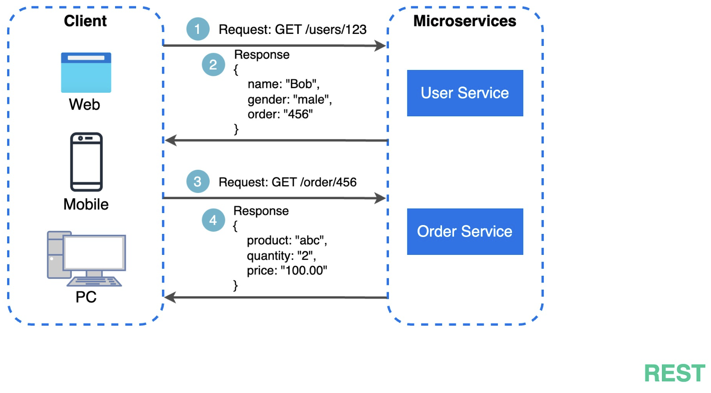
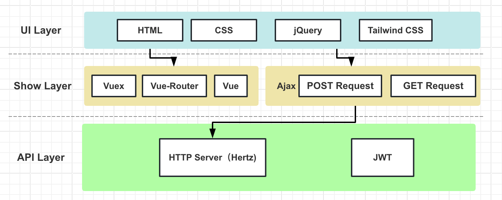
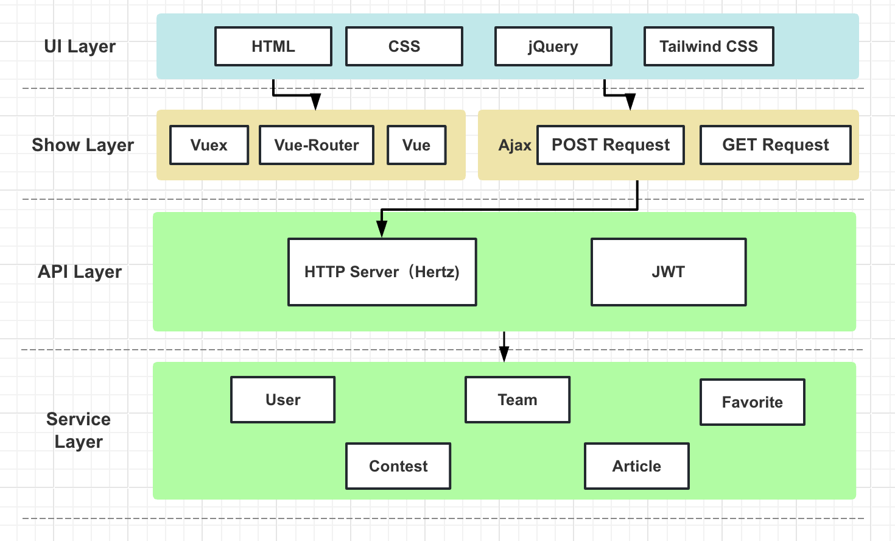
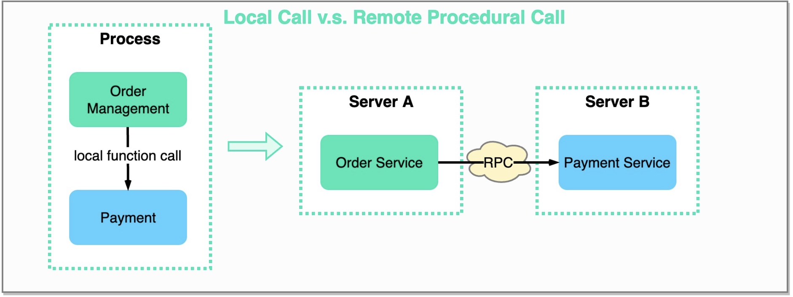
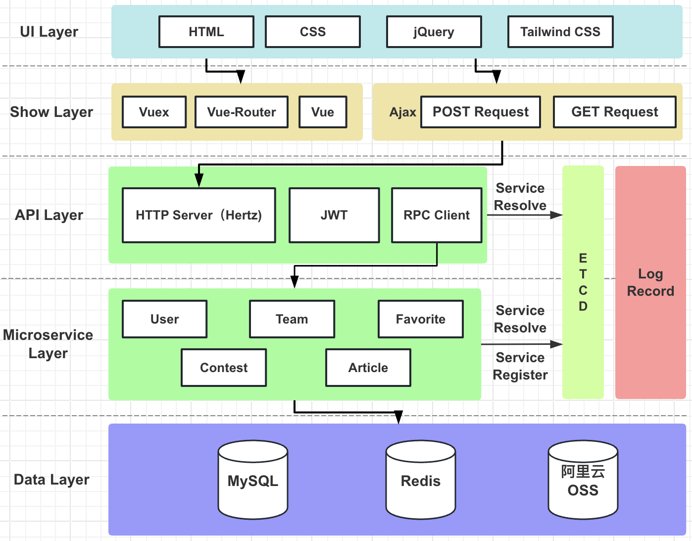
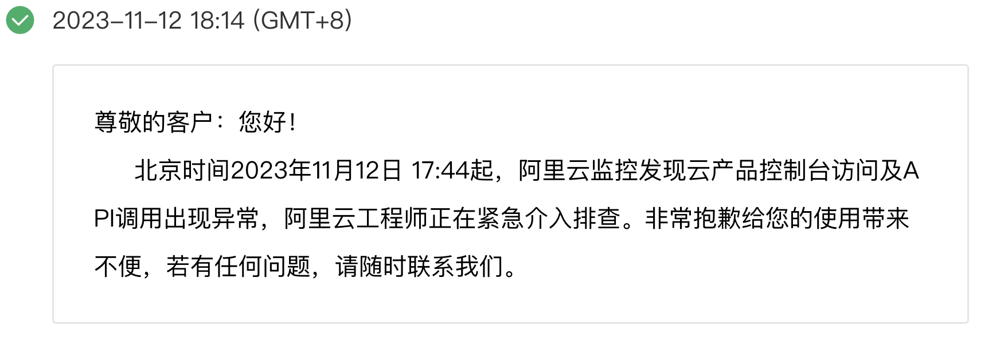

# Fusion 系统架构设计

———— 前后端分离 / 微服务入门实践

<!--s-->

# 业务场景分析

（系统设计的基石）

<!--v-->

## Fusion 业务场景简单分析 👀

1、  竞赛资讯发布与组队系统

2、  面向有竞赛组队需求的学生

3、  峰值在线人数：500 - 1000 人？（maybe）

4、  使用场景：

<h4>
    当一个新的竞赛发布后，会成立一个对应的赛事板块，在这个板块下收集了全部相关的官网推送文；如果是一个团体竞赛，则同学们可以在该板块下，进行组队。另外，用户可以管理自己的个人档案，并对赛事板块进行收藏。
</h4>

5、  分布式架构下，对三高（高并发、高性能、高可用）要求并不高，但对安全性要求较高

6、  加入缓存的场景下，可以接受短暂的数据不一致

7、  ...

<!-- .element: class="fragment" -->

<!--s-->

# 前端篇

<!--v-->

## 前端篇

1、 Vue3 + Vue 生态系统下的各种框架

2、 Tailwind CSS 框架 + 各大衍生组件库

3、『 REST API 』通过 POST 和 GET Request 向后端发起请求

<!--s-->

# 服务端篇

（大的来了）

<!--v-->

## 「序」：一些需要提前了解的小常识 📖

1、  前后端分离 👉 前端后端各司其职

2、  Q：如何统一思想，避免各写各的呢❓❓❓
<!-- .element: class="fragment" -->

3、  A：规定接口文档！ [Fusion 接口文档](https://apifox.com/apidoc/shared-f57b848c-5302-494c-b088-6e2443d055bb)

<!-- .element: class="fragment" -->

> 接口规定了程序要做些什么，<u>但不包括程序的实现</u>
<!-- .element: class="fragment" -->

> *  **「**例**」** 定义用户信息获取接口，路由为 `/user/info` 
> *  前端可以通过 `GET` 请求从这个接口获取信息 
> *  后端可以从这个接口收到请求并返回响应 
<!-- .element: class="fragment" -->

4、  这样前后端不用通过互 call 📞，就能达成统一了！👬

<!-- .element: class="fragment" -->

<!--v-->

## 「API」模块设计

1.  HTTP Server ———— [Hertz 框架](https://www.cloudwego.io/zh/docs/hertz/)
<!-- .element: class="fragment" -->

 

 

2.  JWT 中间件（JSON Web Tokens）
  *  ✅ 代替了 Session 管理会话状态

  *  ✅ 负责用户身份验证 | Authentication

  *  ✅ 对用户进行权限管理 | Authorization

<!-- .element: class="fragment" -->

 

3.  （还偷懒地将图片上传代理放在了这儿 🤫
<!-- .element: class="fragment" -->

<!--v-->

## 「服务」模块设计，但是单体架构版

1.  📹 场景重现：

<h4>
  当一个新的竞赛发布后，会成立一个对应的<green>赛事板块</green>，在这个板块下收集了全部相关的<green>官网推送文</green>；如果是一个团体竞赛，则同学们可以在该板块下，进行<green>组队</green>。另外，<green>用户</green>可以管理自己的个人档案，并对赛事板块进行<green>收藏</green>。
</h4>

<!-- .element: class="fragment" -->

2.  划分成 5 个服务模块  
    *  赛事板块「Contest」
    *  官网推送文「Article」
    *  组队「Team」
    *  用户「User」
    *  收藏「Favorite」

<!-- .element: class="fragment" -->

 

\>\>\>    开发周期短，实现成本也低，非常合适！🤩

<!-- .element: class="fragment" -->

<!--v-->

## 「微服务」章

*  独立模块中的 5 个服务 ➡️ 5 个独立模块的微服务

<!-- .element: class="fragment" -->

*  分别独立部署「分布式」

<!-- .element: class="fragment" -->

*  Q：那微服务之间该如何交互❓ A：还是接口✔️

<!-- .element: class="fragment" -->

*  Q：那数据传输方式呢❓
<!-- .element: class="fragment" -->

*  RPC（Remote Procedure Call）———— [Kitex 框架](https://www.cloudwego.io/zh/docs/kitex/) & Thrift

<!-- .element: class="fragment" -->

<!--v-->

## 「微服务」章

*  Q：10 台服务器部署了 20 个服务，但怎么知道我需要的服务由哪台主机提供呢❓

<!-- .element: class="fragment" -->

*  A：再建个记录了各个服务位置的中心站！🌟「服务治理」—— [etcd](https://github.com/etcd-io/etcd)

<!-- .element: class="fragment" --> 

  

<!-- .element: class="fragment" -->

*  相较于单体架构，你得到了什么？💰

<!-- .element: class="fragment" -->

   1.  可扩展性
   2.  部署灵活、系统整体的可用性
   3.  技术灵活性
   4.  ......

<!-- .element: class="fragment" -->

*  又失去了什么？😭

<!-- .element: class="fragment" -->

   1.  接口管理的额外负担
   2.  代码量大 👨‍💻💦
   3.  分布式系统的所有挑战 ......

<!-- .element: class="fragment" -->

<!--s-->

# 存储架构篇
（更大的来了...）

<!--v-->

## OSS 上传架构

*  OSS 对象存储服务（Object Storage Service）

<!-- .element: class="fragment" -->

*  前端上传文件并发送至后端 ➡️  后端上传至 OSS ➡️  后端得到 OSS 返回的文件 URL  ➡️  返回 URL 给前端并存入数据库

<!-- .element: class="fragment" -->

*  阿里云对象存储 OSS 是一款海量、安全、低成本、高可靠的云存储服务，提供最高可达 99.995 % 的服务可用性 👍

<!-- .element: class="fragment" -->

  

<!-- .element: class="fragment" -->

<!--v-->

## MySQL

*  数据库模块：大家共享一个 vs 各服务内独立创建 ❓

<!-- .element: class="fragment" -->

*  一般更推荐后者 🌟

<!-- .element: class="fragment" -->

 

*  系统架构中处处都有 trade-off（权衡、取舍）

*  完美主义 ❌ - 精益求精 ✅

<!-- .element: class="fragment" -->

<!--v-->

## 再来点 Cache 震撼

*  Redis 

<!-- .element: class="fragment" -->

*  使用场景举例：高峰期 / 数学建模报名组队期...

<!-- .element: class="fragment" -->

*  速度是提升了，但......

<!-- .element: class="fragment" -->

1、  额外中间件的运维 🔧

2、  <red>数据库与缓存数据一致性问题</red>（分布式 CAP 理论中的 C)

<!-- .element: class="fragment" -->

「解决方案」
<!-- .element: class="fragment" -->

1.  不用不就行了😂

<!-- .element: class="fragment" -->

2.  一把分布式大锁保平安🔒（并发问题引发的数据不一致）

<!-- .element: class="fragment" -->

3.  太烦杂了，还是移步这儿吧 ➡️ [Blog](https://yrablog.cn/pages/aac048)

<!-- .element: class="fragment" -->

<!--s-->

# 部署篇
（怎么还有！）

<!--v-->

## 项目部署

1.  腾讯云轻量应用服务器

<!-- .element: class="fragment" --> 

2.  [前端项目地址](http://101.35.229.143/fusion/)

3.  [后端项目地址]()（还没部署

<!-- .element: class="fragment" -->

4.  容器化 ———— [Docker](https://www.docker.com/)

*  MySQL、etcd、Redis 打包三合一

<!-- .element: class="fragment" -->

  

<!-- .element: class="fragment" -->

<!--s-->

# 资料汇总

<!--v-->

## 资料汇总

1.  系统设计插图来源：[system-design-101](https://github.com/ByteByteGoHq/system-design-101)
2.  [Fusion 接口文档](https://apifox.com/apidoc/shared-f57b848c-5302-494c-b088-6e2443d055bb)
3.  [Hertz 框架官方文档](https://www.cloudwego.io/zh/docs/hertz/)
4.  [Kitex 框架官方文档](https://www.cloudwego.io/zh/docs/kitex/)
5.  [etcd](https://github.com/etcd-io/etcd)
6.  [阿里云 OSS](https://www.aliyun.com/product/oss)
7.  Blog：[「缓存和数据库一致性问题」阅读笔记](https://yrablog.cn/pages/aac048/)

<!--s-->

# Thanks

