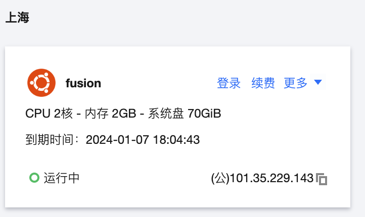
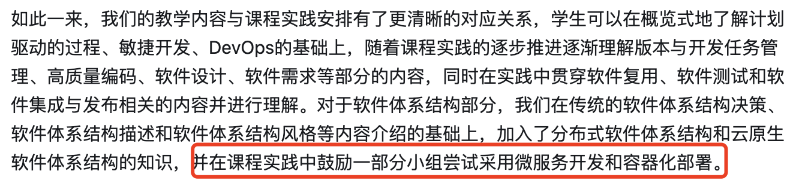

<div class="middle center">
<div style="width: 100%">

# Fusion Presentation

「CoderSky」

组长：茅文俊

团队成员：朱毅成、郭契丹、郭大为、马靖雄
</div>
</div>

<!--s-->

<div class="middle center">
<div style="width: 100%">

# 项目功能展示
<a target="_blank" href="http://101.35.229.143/fusion">Fusion</a>

<a target="_blank" href="https://apifox.com/apidoc/shared-f57b848c-5302-494c-b088-6e2443d055bb">接口文档</a>

</div>
</div>

<!--v-->


<div>

## API 网关模块
</div>

<div class="mul-cols">
<div class="col" style="width:52%;">

```
// Hertz Web框架 - API 网关模块
api
├── Makefile
├── biz
│   ├── handler
│   │   ├── api
│   │   │   └── api_service.go
│   │   ├── handler.go
│   │   └── ping.go
│   ├── model
│   ├── mw
│   │   ├── jwt
│   │   └── oss
│   └── router
├── build.sh
├── main.go
├── router.go
├── router_gen.go
├── rpc
└── script
```

</div>

<div class="col" style="width:auto">

功能：
1. 处理前端请求
2. JWT 鉴权与权限验证
3. 图片文件上传至阿里 OSS
</div>
</div>

<!--v-->

## User 模块

<div class="mul-cols">
<div class="col">

```
// Kitex 微服务框架 - User 服务模块
user
├── Makefile
├── build.sh
├── dal
│   ├── db
│   └── init.go
├── handler.go
├── kitex_info.yaml
├── main.go
├── script
└── service
    ├── check_user.go
    ├── create_user.go
    ├── query_user.go
    ├── query_user_profile.go
    └── upload_action.go

```

</div>

<div class="col">

功能：
1. 用户登录
2. 用户注册
3. 获取 / 上传用户基本信息
4. 获取 / 上传用户档案信息
</div>
</div>


<!--v-->
<div class="mb-0 pb-0">

## Contest 模块
</div>

<div class="mul-cols">
<div class="col" style="width:60%">

```
// Kitex 微服务框架 - Contest 服务模块
contest
├── Makefile
├── build.sh
├── dal
│   ├── db
│   └── init.go
├── handler.go
├── kitex_info.yaml
├── main.go
├── rpc
│   ├── favorite.go
│   └── init.go
├── script
├── service
│   ├── create_contest.go
│   ├── query_contest.go
│   ├── query_contest_favorite_list.go
│   └── query_contest_list.go

```

</div>

<div class="col" style="width:auto">

功能：
1. 赛事板块列表查询
2. 赛事板块信息查询
3. 创建赛事

</div>
</div>


<!--v-->

## Favorite 模块

<div class="mul-cols">
<div class="col" style="width:52%">

```
// Kitex 微服务框架 - Favorite 服务模块
favorite
├── Makefile
├── build.sh
├── dal
│   ├── db
│   ├── init.go
│   └── redis
├── handler.go
├── kitex_info.yaml
├── main.go
├── rpc
├── script
└── service
    ├── contest_favorite_action.go
    ├── contest_favorite_list.go
    └── query_favorite_status.go

```

</div>

<div class="col" style="width:auto">

功能：
1. 收藏赛事板块操作
2. 查询收藏赛事板块列表
</div>
</div>

<!--v-->

## Article 模块

<div class="mul-cols">
<div class="col"">

```
// Kitex 微服务框架 - Article 服务模块
article
├── Makefile
├── build.sh
├── build_linux.sh
├── dal
│   ├── db
│   └── init.go
├── handler.go
├── kitex_info.yaml
├── main.go
├── script
└── service
    ├── create_article.go
    └── query_article_list.go

```

</div>

<div class="col">

功能：
1. 查询赛事列表
2. 创建文章
</div>
</div>

<!--v-->

<div>

## Team 模块
</div>

<div class="mul-cols">
<div class="col" style="width:52%">

```
// Kitex 微服务框架 - Team 服务模块
team
├── Makefile
├── build.sh
├── dal
│   ├── db
│   └── init.go
├── handler.go
├── kitex_info.yaml
├── main.go
├── rpc
├── script
└── service
    ├── create_team.go
    ├── team_application_submit.go
    ├── team_info.go
    ├── team_list.go
    ├── team_manage_action.go
    └── team_manage_list.go

```

</div>

<div class="col" style="width:auto">

功能：
1. 创建队伍
2. 获取队伍列表
3. 获取队伍信息
4. 申请队伍
5. 获取收到的组队请求列表
6. 管理（接受/拒绝）请求
</div>
</div>

<!--s-->

<div class="middle center">
<div style="width: 100%">

# 部分代码讲解

</div>
</div>

<!--v-->

## 图片上传 「API模块」

* 图片上传流程：
  1. 接受前端的上传图片请求

  2. 将请求中的文件传给阿里云并得到图片 URL

  3. 将 URL 返回给前端

* 队伍描述、个人头像
* <a target="_blank" href="https://paste.ubuntu.com/p/CTgfW9qf7q/">Ubuntu Paste</a>

<!--v-->

## Redis 「Favorite模块」

* 写流程：
  1. 更新数据库
  2. 异步更新缓存（Go Routine）
* 读流程：
  1. 查询缓存，成功则直接返回
  2. 查询数据库
  3. 异步更新至缓存（Go Routine）
* 【一致性问题分析】
* <a target="_blank" href="https://paste.ubuntu.com/p/GQ4JyrNtsF/">Ubuntu Paste</a>

<!--s-->

<div class="middle center">
<div style="width: 100%">

# 项目部署

</div>
</div>

<!--v-->

## 项目部署

1. 腾讯云服务器

2. Nginx(HTTP 服务器)

<!--s-->

<div class="middle center">
<div style="width: 100%">

# 项目总结与反思
(如果要实际落地的话...)
</div>
</div>

<!--v-->

## 目前已知存在的问题
- 「前端」深色模式下的颜色会出现不适配的问题(特指macOS系统)
- 「前端」部分 Windows 在登录注册界面，样式会显示错误
- 「后端」测试不够充分，只有 Password 做了简单的单元测试
- ......

<!--v-->

## 未来可以添加的功能
- 退出队伍、踢出队员
- 查看自己的队伍、加入的队伍
- 后台系统：用来创建赛事、管理用户......
- 第三方登录功能
- 手机验证功能
- 密码找回功能
- 登录注册界面的图片可以进行更换
- 增加导航栏左上角的 Logo，并且可以方便返回首页
- MySQL 添加大小写敏感，主要是用户名
- 修复 MySQL 的 emoji 等特殊编码字符
- 增加文件上传功能
- ......

<!--v-->

## 项目总结

* 一次很好的前后端分离 + 微服务实践
* 采用了很多现代化开发工具、中间件、语言
  * Golang + Vue、Docker、MySQL、Redis、JWT...
* 微服务架构开发课程项目的 idea 也很惊喜地与彭老师不谋而合
* <a href="https://zhuanlan.zhihu.com/p/539630312" target="_blank">软件工程教材：百科全书与入门指南-复旦大学CodeWisdom彭鑫</a>

